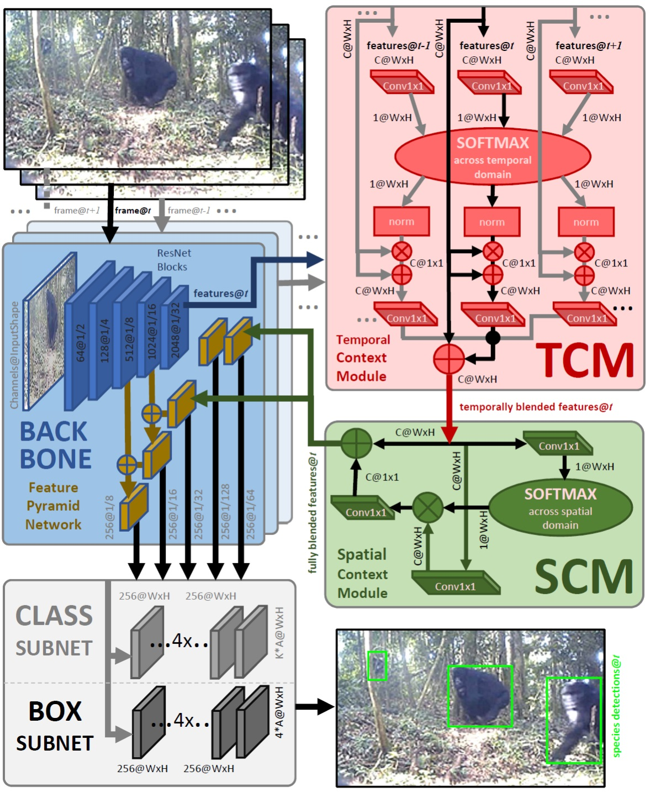
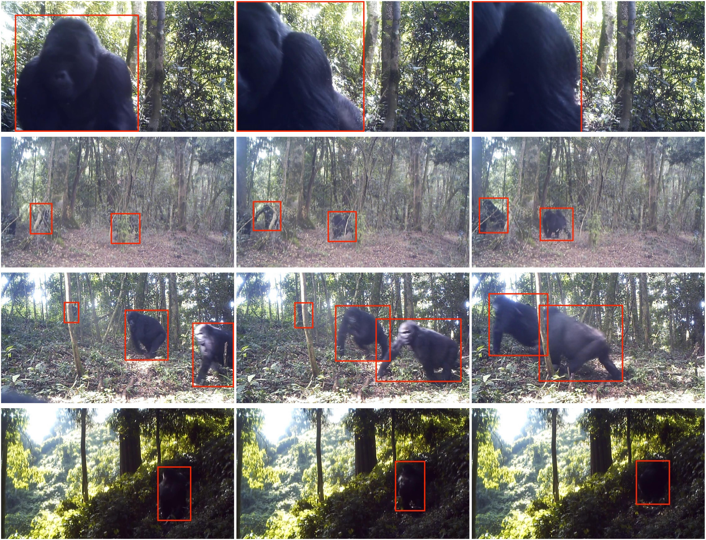

<link rel="shortcut icon" type="image/x-icon" href="favicon.ico">
<p align="center" style="font-size:30px">
<a href="https://youshye.xyz/">Xinyu Yang</a> ,  <a href="http://people.cs.bris.ac.uk/~majid//">Majid Mirmehdi</a> and <a href="http://people.cs.bris.ac.uk/~burghard/">Tilo Burghardt</a>
</p>



## Abstract

We propose the first multi-frame video object detection framework trained to detect great apes. It is applicable to challenging camera trap footage in complex jungle environments and extends a traditional feature pyramid architecture by adding self-attention driven feature blending in both the spatial as well as the temporal domain. We demonstrate that this extension can detect distinctive species appearance and motion signatures despite significant partial occlusion. We evaluate the framework using 500 camera trap videos of great apes from the Pan African Programme containing 180K frames, which we manually annotated with accurate per-frame animal bounding boxes. These clips contain significant partial occlusions, challenging lighting, dynamic backgrounds, and natural camouflage effects. We show that our approach performs highly robustly and significantly outperforms frame-based detectors. We also perform detailed ablation studies and a validation on the full ILSVRC 2015 VID data corpus to demonstrate wider applicability at adequate performance levels. We conclude that the framework is ready to assist human camera trap inspection efforts. We publish key parts of the code as well as network weights and ground truth annotations with this paper.


## Demo


## Paper

[PDF](https://openaccess.thecvf.com/content_ICCVW_2019/papers/CVWC/Yang_Great_Ape_Detection_in_Challenging_Jungle_Camera_Trap_Footage_via_ICCVW_2019_paper.pdf)

[ArXiv](https://arxiv.org/abs/1908.11240)

## Bibtex

```markdown
@InProceedings{Yang_2019_ICCV,
author = {Yang, Xinyu and Mirmehdi, Majid and Burghardt, Tilo},
title = {Great Ape Detection in Challenging Jungle Camera Trap Footage via Attention-Based Spatial and Temporal Feature Blending},
booktitle = {Proceedings of the IEEE/CVF International Conference on Computer Vision (ICCV) Workshops},
month = {Oct},
year = {2019}
}
```

## PanAfrican2019 Dataset



The annotations for the three datasets can be found [here](https://data.bris.ac.uk/data/dataset/1v9op9lc6zi5g25kkwa5smb3vq).

The Dataset PanAfrican2019 Video can be found [here](mpi2019.txt).

## Acknowledgements
We would like to thank the entire team of the Pan African
Programme: ‘The Cultured Chimpanzee’ and its collaborators for allowing the use of their data for this paper.
Please contact the copyright holder Pan African Programme
at http://panafrican.eva.mpg.de to obtain the dataset. Particularly, we thank: H Kuehl, C Boesch, M Arandjelovic, and
P Dieguez. We would also like to thank: K Zuberbuehler, K
Corogenes, E Normand, V Vergnes, A Meier, J Lapuente, D
Dowd, S Jones, V Leinert, E Wessling, H Eshuis, K Langergraber, S Angedakin, S Marrocoli, K Dierks, T C Hicks,
J Hart, K Lee, and M Murai. Thanks also to the team at
https://www.chimpandsee.org. The work that allowed for
the collection of the dataset was funded by the Max Planck
Society, Max Planck Society Innovation Fund, and Heinz L.
Krekeler. In this respect we would also like to thank: Foundation Ministre de la Recherche Scientifique, and Ministre
des Eaux et Forłts in Cote d’Ivoire; Institut Congolais pour
la Conservation de la Nature and Ministre de la Recherche
Scientifique in DR Congo; Forestry Development Authority
in Liberia; Direction des Eaux, Forłts Chasses et de la Conservation des Sols, Senegal; and Uganda National Council for Science and Technology, Uganda Wildlife Authority,
National Forestry Authority in Uganda.
